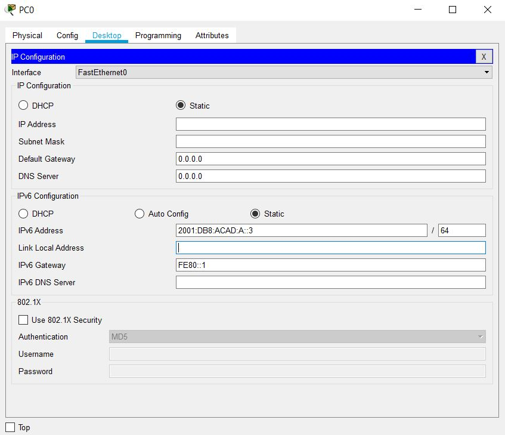
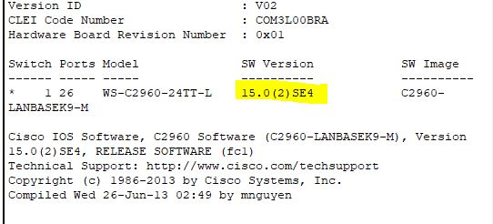

# Documentatie Netwerk-labo projecten 3

## Algemeen

* 

## DEEL 1: maak de netwerkopstelling en initialiseer de toestellen
* Bouw de netwerkopstelling uit overeenkomstig de gegeven topologie
* Initialiseer of reload eventueel de routers en switche: zorg er dus voor dat er geen oude configuratie meer op de toestellen staat
```
Router>enable
Router#write erase 
Router#reload
```

## DEEL 2: Configureer alle toestellen en controlleer de verbindingen
### Configureer de IPv6 adressen op alle PC's
Open de computer, ga naar "desktop" en open "IP configuratie"
Hier vul je het IP en en link-local adres in



### Configuereer de switchen
* maak DNS lookup ongedaan
```
  Switch>enable
  Switch#config terminal 
  Switch(config)#no ip  domain-lookup 
```
* Configureer een hostname
```
  Switch>enable
  Switch#config terminal 
  Switch(config)#hostname S1
```

* Wijs volgende domeinnaam toe: ccna-lab.com
```
  Switch>enable
  Switch#config terminal 
  Switch(config)#ip domain-name ccna-lab.com
```
* Encrypteer de plain-text paswoorden
```
  Switch>enable
  Switch#config terminal 
  Switch(config)#service password-encryption 
```
* Maak een MOTD banner die de gebruikers waarschuwt: "Toegang voor onbevoegden is verboden"
```
  Switch>enable
  Switch#config terminal 
  Switch(config)#banner motd #Toegang voor onbevoegden is verboden#
```
* maak een lokale user database met een gebruikersnaam admin en paswoord classadm
```
  Switch>enable
  Switch#config terminal 
  Switch(config)#username admin password classadm
```
* Configureer class als het privileged EXEC geëncrypteerd paswoord
```
  Switch>enable
  Switch#config terminal 
  Switch(config)#enable secret class
```
* Configureer cisco als het console paswoord en maak login mogelijk
* maak login op de VTY lijnen mogelijk door gebruik te maken van de lokale database
```
  Switch>enable
  Switch#config terminal 
  Switch(config)#line vty 0 15
  Switch(config-line)#password cisco
  Switch(config-line)#login local 
```
* Genereer een crypto rsa key voor ssh, gebruik makend van een modulus grootte van 1024 bits
```
  Switch>enable
  Switch#config terminal 
  Switch(config)#crypto key generate rsa 
  Geef 1024 in 
```
* Verander de transport input op alle VTY lijnen naar alleen SSH en Telnet
```
  Switch>enable
  Switch#config terminal 
  Switch(config)#line vty 0 15
  S1(config-line)#transport input all 
```
* Wijs een IPv6 adres toe aan VLAN 1 overeenkomstig de adrestabel
* Dit geeft een probleem in packet tracer aangezien de switch een verouderd IOS gebruikt deze zullen we updaten
```
 1. Voeg een server toe
 2. geef deze een ip adress bv: 192.168.0.254
 3. geef de switch ook een ip adress bv:
    S1(config)#interface vlan 1
    S1(config-if)#ip address 192.168.0.1 255.255.255.0
    S1(config-if)#no shut 
 4. S1#copy tftp flash
        hierna vraagt hij om het remote host adress, hier geef je het ip adres van de server in. Hierna zal hij de file naam vragen hier geef je hetvolgende in : c2960-lanbasek9-mz.150-2.SE4.bin, erna bevestig je gewoon met een enter.
 5. S1(config)#boot system flash:c2960-lanbasek9-mz.150-2.SE4.bin
    S1(config)#exit
 6. S1#copy running-config startup-config
 7. S1#reload
```

```
  8. S1(config)#sdm prefer dual-ipv4-and-ipv6  default
  9. S1#reload
  10. S1>enable
      S1#config terminal 
      S1(config)#interface vlan 1
      S1(config-if)#ipv6 enable 
      S1(config-if)#ipv6 address 2001:DB8:ACAD:C::3/64

```
### configureer de basisinstellingen op alle routers
* maak DNS lookup ongedaan, configureer hostname en wijs volgende domeinnaam toe: ccna-lab.com
```
  Router>enable
  Router#configure terminal 
  Router(config)#no ip domain-lookup 
  Router(config)#hostname R1
  R1(config)#ip domain-name ccna-lab.com
```
* Encrypteer de plain-text paswoorden
```
  R1>enable
  R1#configure terminal 
  R1(config)#service password-encryption 
```
* Maak een MOTD banner die de gebruikers waarschuwt: "Toegang voor onbevoegden is verboden
```
  R1>enable
  R1#configure terminal 
  R1(config)#banner motd #Toegang voor onbevoegden is verboden"
```
* Maak een lokale user database met een gebruikersnaam admin met paswoord classadm, configureer ook class als et privileged EXEC geëncryteerd paswoord
```
  R1>enable
  R1#configure terminal 
  R1(config)#username admin password classadm
  R1(config)#enable secret class
```
* Configureer cisco als het console paswoord en maak login mogelijk
* maak login op de VTY lijnen mogelijk door gebruik te maken van de lokale database
```
  R1>enable
  R1#config terminal 
  R1(config)#line vty 0 15
  R1(config-line)#password cisco
  R1(config-line)#login local 
```
* Genereer een crypto rsa key voor ssh, gebruik makend van een modulus grootte van 1024 bits
```
  R1>enable
  R1#config terminal 
  R1(config)#crypto key generate rsa 
  Geef 1024 in 
```
* Verander de transport input op alle VTY lijnen naar alleen SSH en Telnet
```
  R1>enable
  R1#config terminal 
  R1(config)#line vty 0 15
  R1(config-line)#transport input all
```
### Configuratie Ipv6 instellingen op R1
* Configureer de IPv6 unicast adressen op de volgende interfaces: g0/0,... 
* Configureer de IPv6 link-local adressen op de volgende interfaces: g0/0,...
```
  R1>enable
  R1#config terminal 
  R1(config)#ipv6 unicast-routing
  R1(config)#int Gi0/0
  R1(config-if)#ipv6 address (ipv6 adres)
  R1(config-if)#ipv6 address FE80::1 link-local
```

* zet de clock rate op s0/0/0 op 128000
* Zorg ervoor dat de interfaces IPv6-pakketten kunnen versturen
```
  R1>enable
  R1#config terminal 
  R1(config)#clock rate 128000
  R1(config)#ipv6 enable
```
* Enable unicast routing
* Configureer OSPFv3 op R1
* Lan interfaces Passief maken
```
  R1>enable
  R1#config terminal 
  R1(config)# ipv6 unicast-routing
  R1(config)#ipv6 router ospf 20
  R1(config-rtr)#router-id 1.1.1.1
  R1(config-rtr)#passive-interface gigabitEthernet 0/0/1
```

## Deel 3: configureer en controleer IPv6 ACL's
### Stap 1 configureer en controleer VTY beperkingen op R1
* Maak de ACL aan, en voeg de restrictie regel van telnet toe
```
  R1>enable
  R1#config terminal 
  R1(config)#ipv6 access-list RESTRICT-VTY
  R1(config-ipv6-acl)#permit tcp 2001:db8:acad:a::/64 eq telnet any
  R1(config-ipv6-acl)#permit tcp any eq 22 any
```
* Pas de RESTRICT-VTY ACL toe op de VTY lijnen van R1
```
  R1(config)#line vty 0 15
  R1(config-line)#ipv6 access-class RESTRICT-VTY in
```
* Toon de nieuwe ACL 
```
R1#show ipv6 access-list 
```

### Stap 2 Beperk de Telnet-Toegang tot het 2001:db8:acad:a::/64 netwerk
* Maak een (Extended) ACL genaamd RESTRICTED-LAN dat alle Telnet-toegang tot het 2001:db8:acad:a::/64 netwerk blokkeert. Configuratie ACL:
```
  R1>enable
  R1#config terminal  
  R1(config)#ipv6 access-list RESTRICTED-LAN
```

* Maak een (extended) ACL genaamd RESTRICTED-LAN  dat alle Telnet-toegang tot het 2001:db8:acad:a::/64 netwerk blokkeert.
```
  R1(config)# ipv6 access-list RESTRICTED-LAN
  R1(config-ipv6-acl)# deny tcp any 2001:db8:acad:a::/64 eq telnet
  R1(config-ipv6-acl)# permit ipv6 any any
  R1(config-ipv6-acl)# exit
```

* Pas de  RESTRICTED-LAN ACL toe op de G0/1 interface van R1 voor al het uitgaande verkeer. 
```
  R1(config)# int g0/1
  R1(config-if)# ipv6 traffic-filter RESTRICTED-LAN out
```

* Toon de nieuwe ACL. 
```
R1# show access-lists RESTRICTED-LAN
```

* Toon opnieuw de ACL om te controleren dat de tellers inderdaad terug op nul staan.
```
show ipv6 access-lists RESTRICTED-LAN
```
