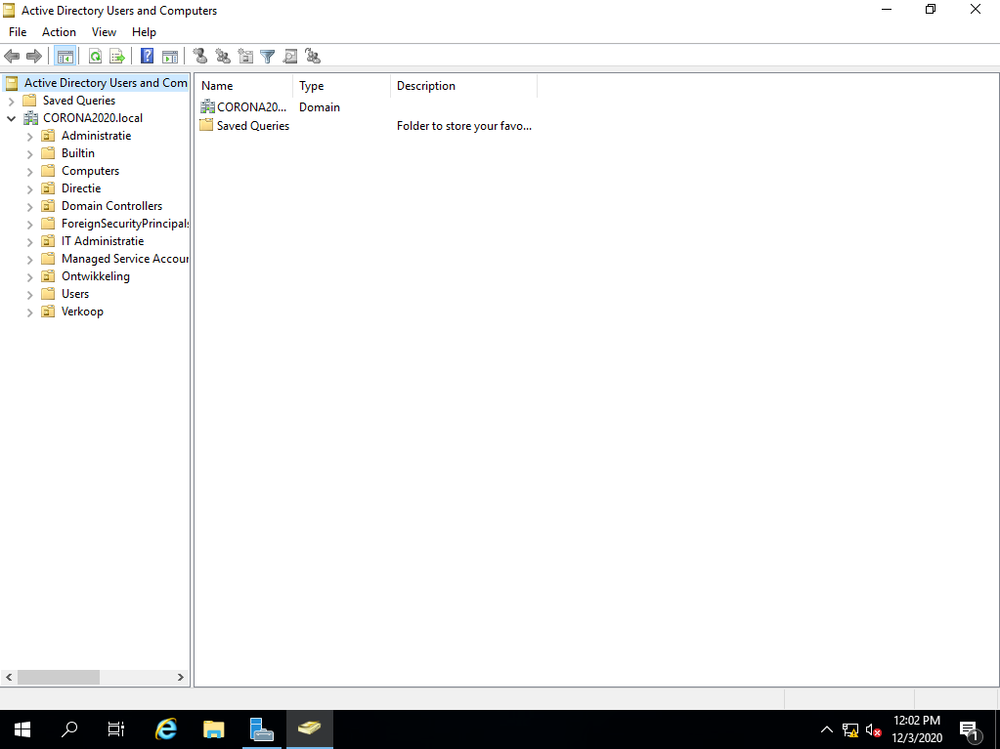
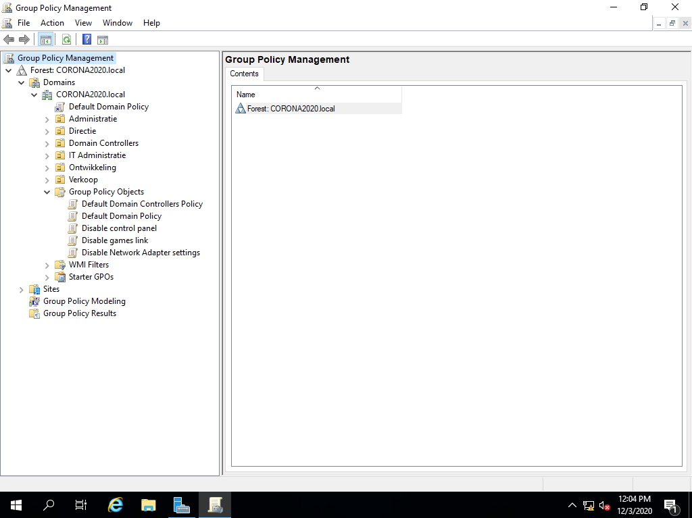

# Test report Domain Controller

In this test report the stept to reproduce a functional Domain Controller were followed using the Vagrant Option.


## (PART 1: OPTIONAL) Vagrant

The `vagrant destroy -f` command was run to ensure that there were no previous build present, this completed without a problem.

Next `vagrant up bravo` was performed in the `/src/linux` folder to start the installation of the DNS server.

Then `vagrant up` was performed to start the install of the Domain Controller, after a few minutes the Domain Controller was up and running.

## (PART 3) Confirming everything works

### 3.1 Check AD functionality

1. `dcdiag /test:dns /v /s:alfa /DnsBasic /f:dcdiagreport.txt` was executed.


1. Domain was set correctly
2. IP was set correctly


### 3.2 Check Organisational Units

Navigating to `TOOLS -> Active directory Users and Computers` gave the following results.



### 3.3 Create user accounts through CSV file

The OU's had following users added to them.  
  
  
  
  
  

### 3.4 Creating group policies

Navigating to `Tools -> Group policy management`, `Forest: CORONA2020.local -> Domains -> CORONA2020.local -> Group Policy Objects` gave the following results.




### 3.5 DFS

The next check was not possible due to the lack of a working SCCM server at this point in time.
```
On the server manager, navigate to `Tools -> DFS management`. In the left panel, when you expand Namespaces, there should be one namespace enabled for our domain.
```


Author: Glenn Delanghe
