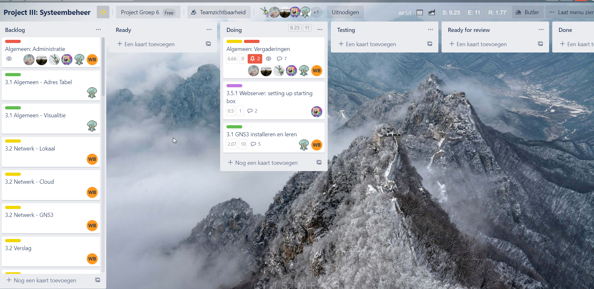
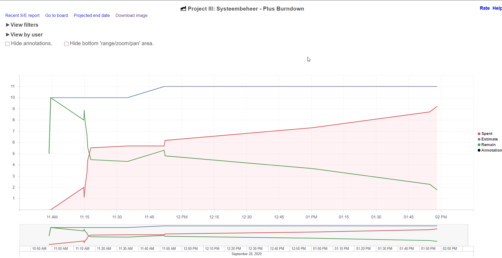
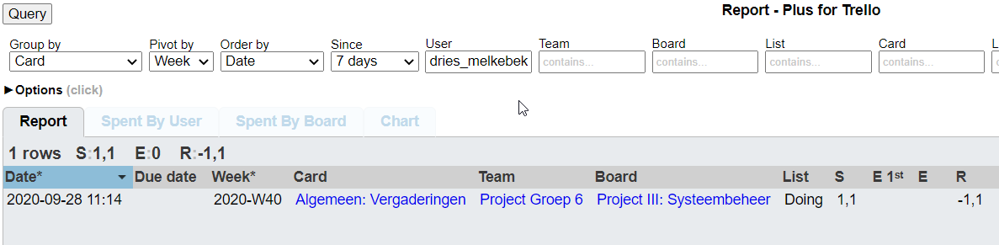
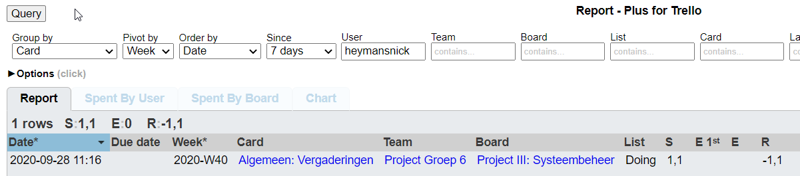
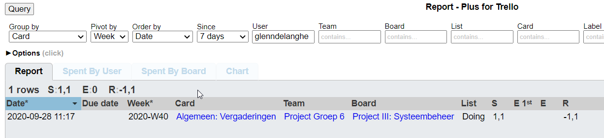
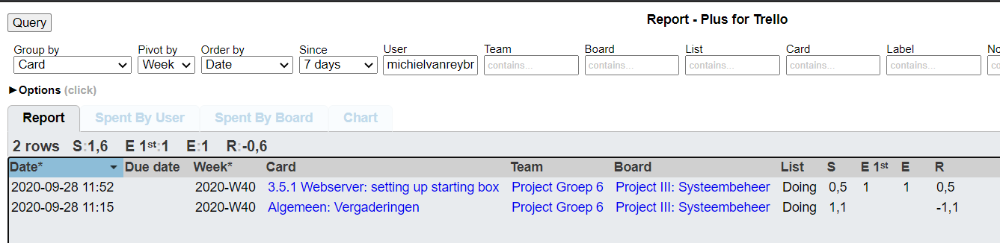
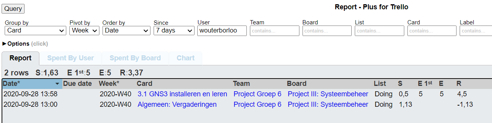
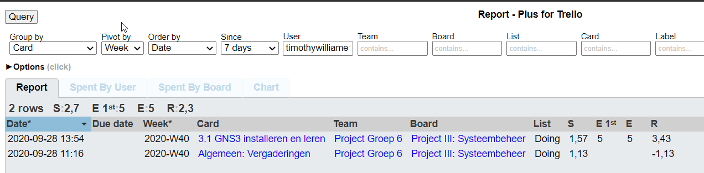

# Intervisiegesprek

|                     |                   |
|--------------------:|:------------------|
|            **Week** | 2                 |
|           **Datum** | 2020-09-28, 14:30 |
|        **Aanwezig** | Dries, Nick, Glen, Michiel, Wouter, Timothy                  |
| **Verontschuldigd** | /                  |
|         **Afwezig** | /                  |
|    **Verslaggever** |                   |

## Agenda

- Realisaties vorige periode
  - Taakverdeling
  - Aanmaken Github repository
  - Aanmaken Trello bord
- Problemen
- Planning komende periode

## Realisaties vorige periode

### Algemeen

### [DriesMelkebeke](https://github.com/DriesMelkebeke)

## Realisaties

1. Aanmaken algemene Trello kaarten
2. Communicatie en organisatie met Team

### [HeymansNick](https://github.com/HeymansNickk)

## Realisaties

1. Aanmaken trello bord
2. Communicatie en organisatie met Team

### [WouterBorloo](https://github.com/wouterBorloo)

## Realisaties

1. Aanmaken trello bord
2. Communicatie en organisatie met Team

### [MichielVanreybrouck](https://github.com/MichielVanreybrouck)

## Realisaties

1. Aanmaken trello bord
2. Communicatie en organisatie met Team

### [GlennDelanghe](https://github.com/GlennDelanghe)

## Realisaties

1. Aanmaken trello bord
2. Communicatie en organisatie met Team

## Problemen

N/A

## Planning komende periode

Start en documentatie Domain Controller  
Research en start DNS Server  
Testopstelling en opzoeken Postfix en Dovecot  
Starten aan het netwerk (eerst lokaal), onderzoek doen naar werken met hybrid cloud-omgeving  
