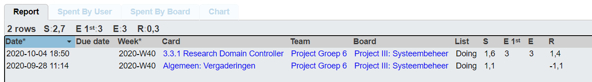
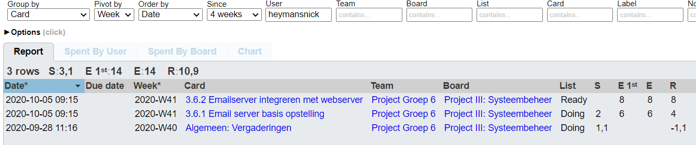
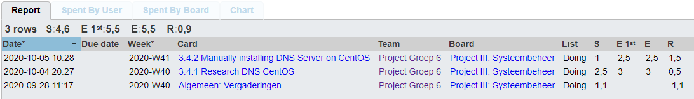
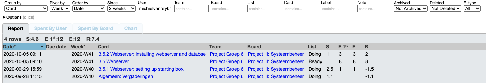
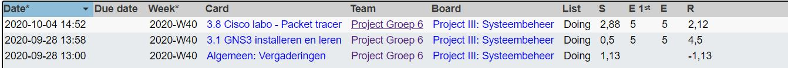
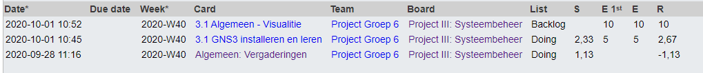

# Intervisiegesprek

|                     |                   |
|--------------------:|:------------------|
|            **Week** | 3                 |
|           **Datum** | 2020-10-05, 14:30 |
|        **Aanwezig** |                   |
| **Verontschuldigd** |                   |
|         **Afwezig** |                   |
|    **Verslaggever** |                   |

## Agenda

- Realisaties vorige periode
  - Aanmaken documentatie en research Domain Controller
- Problemen
- Planning komende periode

## Realisaties vorige periode

### Algemeen

### [DriesMelkebeke](https://github.com/DriesMelkebeke)

## Realisaties

1. Aanmaken documentatie Domain Controller
2. Research domaincontroller
3. Aanmaken rapportering week 3

### [HeymansNick](https://github.com/HeymansNickk)

## Realisaties

1. Troubleshooten van vagrant
2. Uitproberen van ansible roles (https://github.com/bertvv/ansible-role-mailserver)

### [WouterBorloo](https://github.com/wouterBorloo)

## Realisaties

1. Aanmaken trello bord
2. Communicatie en organisatie met Team

### [MichielVanreybrouck](https://github.com/MichielVanreybrouck)

## Realisaties

1. Starten met opzetten webserver en database
2. Research naar ansible

### [GlennDelanghe](https://github.com/GlennDelanghe)

## Realisaties

1. Research naar DNS Server op CentOS (evt al met ansible)
2. Starten met opzetten DNS Server

### [TimothyWilliame](https://github.com/scoffir)

## Realisaties

1. Aanmaken Trellobord
2. Communicatie en organisatie met Team
3. Installeren van GNS3 en het leren werken met GNS3

### [WouterBorloo](https://github.com/wouterBorloo)

## Realisaties

1. Starten Labo in packettracer
2. Documentatie bijhouden 

## Problemen

N/A

## Planning komende periode

- Testing automation Domain Controller
- Webserver afwerken + (documentatie schrijven)
- Emailserver afwerken + Documentatie schrijven
- DNS Server afwerken
- Labo packettracer afwerken
- Adrestabel maken
